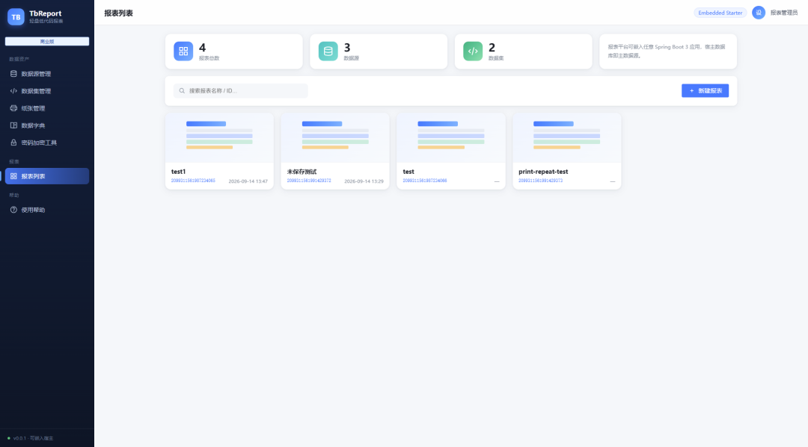
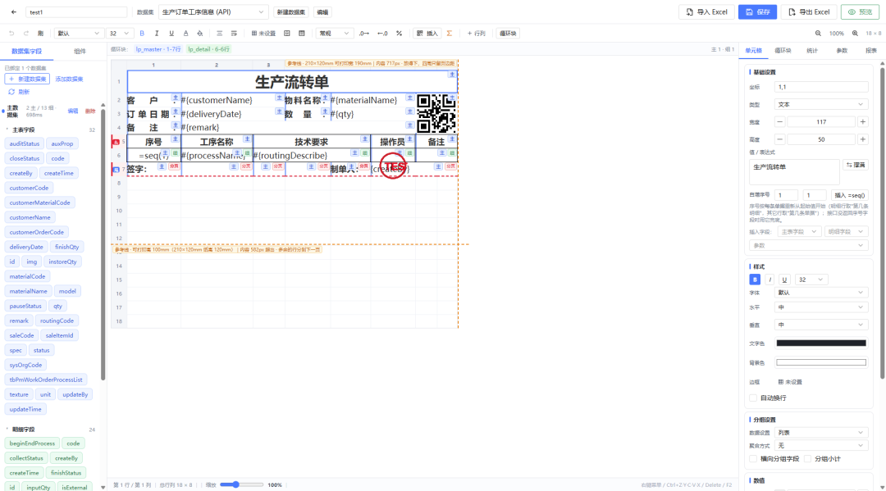
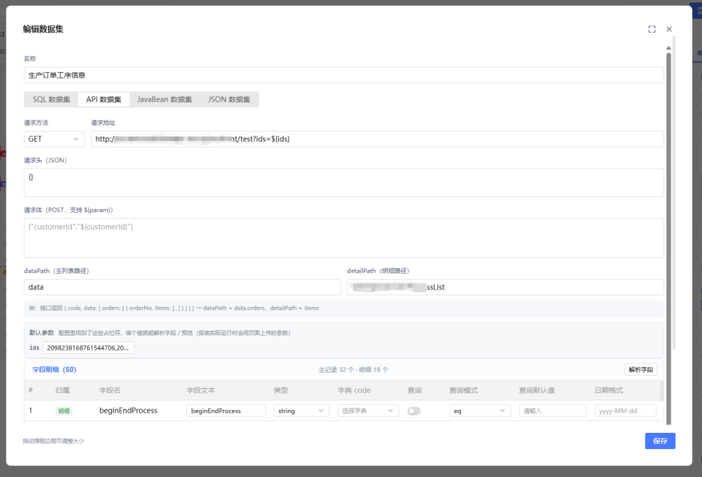
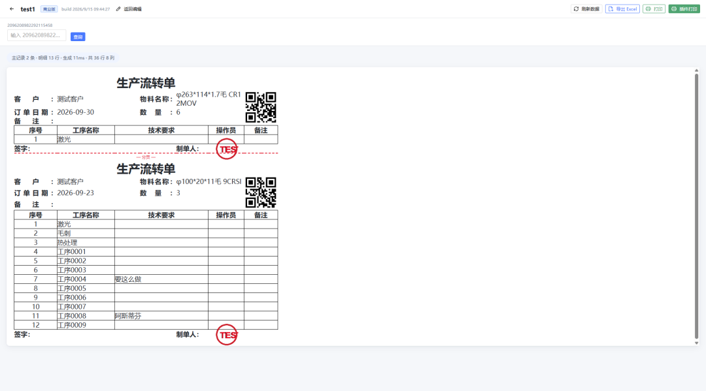
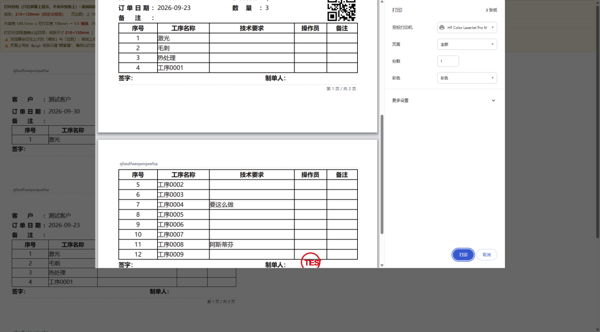

# TbReport · 可嵌入 Spring Boot 3 的轻量低代码报表工具

TbReport 是一个**低代码报表 / 报表设计器**：在浏览器里画表格、绑定字段，就能做出**销售报表、对账单、发货单、检验单、工资单**这类**数据报表与打印表单**。
支持**循环块（明细自动展开）、主子表、分组汇总、二维码/条码、1:1 打印套打、导出 Excel**，还能把**在 Excel 里排好版的表格直接导入成报表模板**；
前端页面随 jar 一起发布，**一个依赖**嵌进你的 Spring Boot 3 项目，不用单独部署前端。
可作为 **JimuReport（积木报表）** 一类商业报表工具的**免费替代方案**。

> Lightweight low-code reporting for Java / Spring Boot 3: visual report designer, master-detail & loop blocks,
> SQL / HTTP / JSON datasets, 1:1 print forms, Excel import/export, page numbers & stamps — front-end included, embed with one jar.

本仓库**只包含演示程序（`report-demo`）的源码与文档**，报表引擎与集成外壳以**编译好的 jar** 形式提供
（`lib/tb-report-spring-boot-starter-*.jar`），因此 clone 下来不含引擎源码。

> 💚 **永久免费使用**：**不收费、不限期** —— 没有试用期、没有到期日，也没有授权码、不联网校验；
> 商用、内网、多少个项目、多少用户都可以。唯一不能做的是**把它本身当商品转售**，以及**反编译 jar**（详见[第七节 许可](#七许可license)）。
> 觉得好用，欢迎到文末[支持下作者](#八制作不易打赏随缘)。

你可以用它做两件事：

| 我想…… | 看哪一节 |
|---|---|
| 直接跑起来看看长什么样 | [一、30 秒启动演示](#一30-秒启动演示) |
| 把它嵌进我自己的系统 | [二、集成到你的 Spring Boot 项目](#二集成到你的-spring-boot-项目) |
| 自己编译本仓库的 demo | [三、自己编译 demo](#三自己编译-demo) |
| 看它支持哪些功能 | [四、功能一览](#四功能一览) |

---

## 一、30 秒启动演示

**前提**：本机有 **Java 17 或更高**（`java -version` 能看到 17+）。

1. 到本仓库的 **Releases** 页面下载 `tb-report-demo-<版本>.jar`（约 45 MB，含内嵌前端与示例数据库，所以不放进 git）。
2. 在任意目录执行：

```bash
java -jar tb-report-demo-<版本>.jar --report.metadata.datasource-id=MAIN
```

3. 浏览器打开 **http://localhost:8080/report/reports**

`--report.metadata.datasource-id=MAIN` 的意思是"报表配置数据放在自带的本地文件数据库里"——
不写这个参数它会去找本地 MySQL，没有就启动失败（见[常见问题](#六常见问题)）。

启动后你会看到：

| 页面 | 地址 | 干什么的 |
|---|---|---|
| 报表列表 | `/report/reports` | 新建/打开/复制报表，进入设计器与预览 |
| 设计器 | `/report/designer/{id}` | 拖字段、画表格、设循环块、配打印 |
| 预览 | `/report/viewer/{id}` | 填参数、看真实数据、打印/导出 Excel |
| 数据集 | `/report/datasets` | 配 SQL / HTTP 接口 / JSON / JavaBean 取数，解析字段 |
| 数据源 | `/report/datasources` | 看配置文件里声明了哪些库 |
| 数据字典 | `/report/dicts` | 字段值 → 显示名（手工 / 接口 / SQL） |
| 纸张管理 | `/report/papers` | 维护纸张规格 |
| 使用帮助 | `/report/help` | **操作手册**（含截图）：从建数据集到打印的完整流程 |

> 演示数据会写在你执行命令的那个目录下的 `tb-report.mv.db`，删掉它就回到"全新状态"。

### 界面长这样

**① 报表列表** —— 新建 / 复制 / 搜索，直接进设计器或预览



**② 可视化设计器** —— 拖字段、画表格、循环块、二维码、边框合并，右侧属性面板一站式配置



**③ 数据集** —— SQL / HTTP 接口 / JSON / JavaBean，自动解析出主表与明细字段



**④ 预览** —— 填参数、取真实数据、主/明细自动展开，二维码与印章跟着内容走



**⑤ 打印** —— 1:1 套打、每页重复表头表尾、页码，直接选打印机出纸



---

## 二、集成到你的 Spring Boot 项目

### 1）把 jar 装进你的本地仓库

本仓库 `lib/` 目录下的就是集成用的 jar：

```bash
mvn install:install-file -Dfile=lib/tb-report-spring-boot-starter-<版本>.jar ^
  -DgroupId=io.github.tb2888 -DartifactId=tb-report-spring-boot-starter -Dversion=<版本> -Dpackaging=jar
```

（Linux/macOS 把行尾的 `^` 换成 `\`。）

### 2）在你的 pom 里加依赖

```xml
<dependency>
  <groupId>io.github.tb2888</groupId>
  <artifactId>tb-report-spring-boot-starter</artifactId>
  <version><版本></version>
</dependency>
```

### 3）你需要自备的东西

- **Spring Boot 3.3.x**（web 与 jdbc 会由本 starter 带过去）
- **你自己的数据库 JDBC 驱动**（本 starter 故意不强制任何驱动：MySQL / Oracle / PG / SQL Server / H2 都行）
- 想用后端导出 xlsx，再引 `poi-ooxml`（不引就只有前端导出，不影响其他功能）

### 4）最小配置（`application.yml`）

```yaml
report:
  enabled: true
  # 报表的元数据（报表/数据集/纸张/字典）放哪个库：
  #   MAIN = 你应用的主库；也可以填下面 datasources 里声明的 id
  metadata:
    datasource-id: MAIN
  # 数据源密码的加密密钥：20 位以上、大小写字母+数字，必须改掉
  encrypt-key: 请改成你自己的随机串_20位以上
  datasources:
    - id: biz
      name: 业务库
      type: MYSQL
      url: "jdbc:mysql://127.0.0.1:3306/mydb?useUnicode=true&characterEncoding=utf8&serverTimezone=Asia/Shanghai"
      username: root
      password: ""        # 支持三种写法：ENC(密文) / ${环境变量} / 明文
```

**程序默认不碰你的数据库**：启动时**不建表、不改表、不探测**，连元数据连接都不会取 ——
元数据表（`tb_report*`）请用下面的 SQL 脚本自己建。想让程序把**缺的表**建出来，
把 `report.metadata.auto-init` 设为 `true`（默认 `false`）。

即便打开了它，也只是"建缺的表"，**已存在的表一律不动**（不删、不改名、不改结构）。
升级版本后如果缺列，启动日志里会写出该执行的 `ALTER TABLE` 语句，由你决定何时执行；
想让程序自己补列，还要把 `report.metadata.auto-upgrade` 设为 `true`（默认 `false`）。

- 要让 DBA 提前建库建表、或想在 Navicat 里先看表结构：用仓库里的
  [`db/mysql/tb-report-metadata.sql`](db/mysql/tb-report-metadata.sql) —— 6 张元数据表的 MySQL 8 DDL
  （**始终是最新版本的全量结构**），**纯表结构、不带注释**、可重复执行。
  改了 `report.table-prefix` 的话，先整体替换脚本里的表名前缀。
- **老库升级**：按版本号**从小到大**依次执行 `db/mysql/upgrade/vX.Y.Z.sql`（文件名 = "从上一版升到该版本"）。
  目前有 [`v1.0.0.sql`](db/mysql/upgrade/v1.0.0.sql)，只给 v1.0.0 之前用过 0.0.x 快照版的老库用；新装不用跑。
- 密码不想写明文：进 `/report/password-tool` 页面生成 `ENC(...)` 密文再填进来。
- 更多配置项（表名前缀、渲染行数上限、超时、多数据源池参数等）见 `report.*` 的注释说明。

### 5）需要鉴权时

默认**放行所有请求**。要接你自己的登录态，实现一个 Bean 即可（接口名与签名保持稳定，不会因版本升级而变）：

```java
@Bean
public ReportAccessProvider reportAccessProvider() {
    return request -> {
        // 返回 false → 403；在这里读你的 token/session
        return myAuthService.isLoggedIn(request);
    };
}
```

### 6）前后端一套带走

前端页面已经打进 jar（`/report/**`），**不需要你单独部署前端**。启动后直接访问
`http://你的域名:端口/report/reports`。

### 7）Java 版本要求（Java 8 / 11 的老项目怎么用）

**本软件是 Java 17 字节码 + Spring Boot 3**（starter jar 里类的 major version = 61），所以：

| 你的项目 | 能不能同进程集成（加 starter 依赖） | 怎么做 |
|---|---|---|
| Spring Boot 3 / Java 17+ | ✅ 可以 | 按上面 1）~6）做，一个依赖嵌进去 |
| Spring Boot 2 / **Java 8、11** | ❌ 不行（JVM 直接报 `UnsupportedClassVersionError`） | 用下面的「独立部署 + 对接」 |
| 非 Java 系统（.NET / PHP / Node…） | ❌ 同上 | 同样用「独立部署 + 对接」 |

**Java 8/11 老项目的做法：让报表独立跑，老系统通过接口 / 页面 / 回调对接它**

1. 找一台有 **Java 17** 的机器，把报表服务跑起来（示例是开箱即用的演示包）：
   ```bash
   java -jar tb-report-demo-<版本>.jar --server.port=8085 --report.metadata.datasource-id=MAIN
   ```
   正式使用建议把 `lib/tb-report-spring-boot-starter-*.jar` 放进你自己的 Java 17 壳工程，按第 4 步配数据源、按第 5 步接鉴权。
2. 老系统（Java 8 也行）用 **HTTP** 跟它打交道，三种方式按需混用：
   - **调接口**：`POST /report/api/reports/{id}/render` 拿渲染结果（JSON），自己在老系统里用、或再导出；
   - **嵌页面**：把 `/report/reports`、`/report/viewer/{id}` 用 **iframe** 嵌进老系统的页面（只要求浏览器能访问到报表服务，跟老系统的 Java 版本无关）；
   - **打印回调**：报表打印完，由报表服务回调你老系统的接口（报表属性里配「打印后回调接口」），"打完一张单改一次状态"的逻辑仍留在老系统。
3. 数据源：报表服务可以直接连老系统的库（`report.datasources[]` 里配），也可以用 HTTP 数据集调老系统的接口。
4. 鉴权：报表服务里实现一个 `ReportAccessProvider` Bean 校验 token，老系统把登录凭证（`Authorization` 头）透传过来即可。

> 一句话：**同进程集成必须 Java 17；Java 8/11 的项目就让报表独立部署，用接口 / iframe 页面 / 打印回调对接。**

### 8）示例：接入 JeecgBoot 的登录态

JeecgBoot 自己前端发的头是 **`X-Access-Token`**，登录成功后 `LoginUser` 会存进 Redis（key = `CommonConstant.PREFIX_USER_TOKEN + token`）；
而**报表前端固定把同一串 token 放在 `Authorization` 头**，所以下面的 provider **两个头都读**，两端都能用。

```java
package org.jeecg.modules.report.config;      // 放在你自己会被 Spring 扫到的包

import com.jimu.report.starter.security.ReportAccessProvider;
import jakarta.servlet.http.HttpServletRequest;
import org.jeecg.common.system.vo.LoginUser;   // ⚠️ 类名/包名按你的 JeecgBoot 版本核对
import org.jeecg.common.util.JwtUtil;
import org.springframework.context.annotation.Bean;
import org.springframework.context.annotation.Configuration;
import org.springframework.context.annotation.Primary;

@Configuration
public class ReportSecurityConfig {

    @Bean
    @Primary                                  // 覆盖 starter 里"全放行"的默认实现
    public ReportAccessProvider reportAccessProvider() {
        return request -> {
            String token = readToken(request);
            if (token == null || token.isBlank()) {
                return false;
            }
            try {
                LoginUser user = JwtUtil.verifyToken(token);   // token 无效会抛异常
                if (user == null) {
                    return false;
                }
                // 想再收紧：只允许某些角色访问报表（按需打开）
                // String roles = user.getRoleCode();
                // return roles != null && (roles.contains("admin") || roles.contains("report"));
                return true;
            } catch (Exception e) {
                return false;
            }
        };
    }

    /** 报表页面发的是 Authorization；Jeecg 自己发的是 X-Access-Token —— 两个头都读 */
    private static String readToken(HttpServletRequest request) {
        String t = request.getHeader("X-Access-Token");
        if (t == null || t.isBlank()) {
            t = request.getHeader("Authorization");
        }
        if (t != null && t.startsWith("Bearer ")) {
            t = t.substring(7);
        }
        return t;
    }
}
```

**不想依赖 Jeecg 内部类**（版本之间类名有差异时更稳）：直接把 Redis 当"登录态白名单"查，有值就是已登录：

```java
@Bean
@Primary
public ReportAccessProvider reportAccessProvider(RedisUtil redisUtil) {
    return request -> {
        String token = readToken(request);              // 同上
        if (token == null || token.isBlank()) {
            return false;
        }
        // key 与 Jeecg 登录时写入的保持一致
        return redisUtil.hasKey("prefix_user_token_" + token);
    };
}
```

**token 怎么进到报表页面**（同域部署通常不用管）：报表前端会自己找 —— 优先 `window.__REPORT_TOKEN__`，其次 URL 上的 `?__token=xxx`，再不行就扫 localStorage / sessionStorage（Jeecg Vue3 存的 `pro__Access-Token` 能被扫到）。都拿不到时才需要手工注入。

> ⚠️ `JwtUtil` / `TokenUtils` / `LoginUser` / `CommonConstant` 这些类在不同 JeecgBoot 版本里包路径略有差异（Shiro → Spring Security 迁移期间尤其明显），请以你项目里的实际引用为准；拿不准就用上面那版「查 Redis」的写法。

---

## 三、自己编译 demo

1. 先按[第二节第 1 步](#1把-jar-装进你的本地仓库)把 `lib/` 里的 starter jar 装进本地 Maven 仓库（demo 依赖它）。
2. 然后：

```bash
mvn clean package
java -jar report-demo/target/tb-report-demo-<版本>.jar
```

本仓库里的 `application.yml` 已经默认落在本地 H2 文件库（`MAIN`），无需额外参数。

---

## 四、功能一览

| 功能 | 说明 |
|---|---|
| 报表设计器 | 单元格样式/边框、拖选与填充柄、撤销重做、格式刷、数字格式、缩放；**导入 Excel / 导出 Excel** |
| 循环块 / 主子表 / 分组汇总 / 统计 | 明细按数据自动展开，主记录与明细联动 |
| 数据集 | SQL / HTTP 接口 / JSON / JavaBean 四种取数方式，自动解析字段 |
| 数据字典 | 字段值 → 显示名（手工维护 / 接口 / SQL），取数后统一翻译 |
| 纸张管理 | 打印设置只选纸张，宽高集中维护 |
| 打印 | 1:1 套打、页边距、页眉页脚、可打印区参考线、手动分页 |
| **打印后回调业务接口** | 打印完自动通知你的系统：POST/GET、带本次页面参数、原样转发登录凭证，用来"打一张单据、自动改一次状态" |
| C-Lodop 插件打印 | 非标纸 / 套打纸 1:1 打印（浏览器纸张选不到时用） |
| Excel 导出 | 带样式与合并的 xlsx |
| **从 Excel 导入模板** | 在 Excel 里把表格排好版，直接导入成报表框架（省得重新画） |
| **每页页码 / 本单据页码** | 按单据分页编号（第 X 页 / 共 Y 页） |
| **电子印章** | 设计器里定位，随单元格 / 明细行自动盖到每一份单据上 |
| **固定打印表头 / 表尾** | 每页重复表头表尾 |

> 需要技术支持、授权或定制开发，请联系 **11295920@qq.com**。

---

## 五、目录结构

```
.
├── README.md
├── pom.xml                 # 只聚合 report-demo
├── report-demo/            # 演示应用源码（Spring Boot 宿主 + 示例数据 + mock 接口）
│   └── src/main/resources/db/  # 示例业务表结构与数据
├── db/mysql/               # tb-report-metadata.sql：最新版全量建表；upgrade/vX.Y.Z.sql：按版本升级（DBA/手工建库用）
└── lib/
    └── tb-report-spring-boot-starter-<版本>.jar   # 集成用（含引擎与内嵌前端）
```

---

## 六、常见问题

**我项目里已经配好数据源了，还要配 `report.datasources` 吗？**

不用。你项目 `spring.datasource` 配的那个库，就是报表里的 **`MAIN` 主数据源**（设计器里显示成「系统内置」，只读）：

- **数据集取数**：数据源直接选 `MAIN`，就是查你宿主库的表；
- **报表元数据表**（`tb_report*`）：默认也建在宿主库里（`report.metadata.datasource-id` 不写 = `MAIN`）。

那两项什么时候才需要写：

| 配置 | 什么时候需要 |
|---|---|
| `report.metadata.datasource-id` | 你**不想**让 `tb_report*` 跟业务表混在一个库（例如宿主库不给建表权限、或想独立备份）→ 填一个库的 id，并把 `db/mysql/tb-report-metadata.sql` 在那个库里先建好表 |
| `report.datasources[]` | 你要让设计器里**多出几个可选的库**（跨库取数）——才需要在这里声明；宿主库之外每多一个库就加一条 |
| `report.table-prefix` | 宿主库里**已经有同名** `tb_report*` 表、冲突了才改（默认 `tb_report_`） |

其余项都有默认值（`enabled=true`、`api-prefix=/report/api`、`ui-path=/report/designer`），**一行都不写也能跑**。真正的前提只有：**Java 17 + Spring Boot 3.x**。

> ⚠️ 若你用的是较早的 `0.0.1-SNAPSHOT` 包（2026-09-15 之前构建的），启动可能报
> `Could not resolve placeholder 'report.api-prefix'` —— 那是旧包的缺陷（Controller 上的路径占位符没有默认值）。
> 两种解法：① 在 yml 里补上 `api-prefix: /report/api` 与 `ui-path: /report/designer`；
> ② 更新到之后的构建（已给占位符加了内联默认值，不再需要手配）。

**启动报数据库连接错误？**
没加 `--report.metadata.datasource-id=MAIN`，它在找你本机的 MySQL。加上这个参数即可用自带文件库。

**端口被占用？**
`java -jar tb-report-demo-<版本>.jar --server.port=9090`

**数据想重置？**
删掉运行目录下的 `tb-report.mv.db`（以及 `demo-biz.mv.db`）后重启。

**浏览器打印出来有空白页 / 页面被裁？**
看 `/report/help` 的「打印设置」一节：纸张、边距、缩放必须按说明设置（缩放 100%、边距最小/默认），
页面里还有一条自检栏会直接告诉你能打印区域多大的问题。非标纸/套打建议用插件打印（C-Lodop）。

**升级版本要注意什么？**
替换 `lib/` 里的 jar 与依赖版本即可，老数据保留。元数据表**不会**自动升级：
看本仓 `CHANGELOG.md` 里对应版本的「数据库变动」小节 —— 有变动就按版本号从小到大执行
`db/mysql/upgrade/vX.Y.Z.sql`（没有变动的那一版就不用执行）。

---

## 七、许可（License）

本仓库采用 **TbReport 许可协议 v1.0（源码可见许可，source-available）**，完整条款见 [`LICENSE`](LICENSE)。
它**不是** OSI 认证的开源协议——因为它限制了部分使用方式。

**费用与期限**：**不收费、不限期**（协议 2.6「免费使用且不限期」；6.3 明确"许可方的责任上限＝你实际支付的费用"）。你拿到的某个版本，永远按它随附的这份 LICENSE 使用。

用一句话概括：

### ✅ 你可以

- 自己用、在公司内部系统里用；
- **把它集成进你自己的商业项目**，对外提供服务（只要这个服务的主要价值不是你转卖的"报表工具"本身）；
- 修改本仓库提供的 demo/文档源码以适配你的项目；
- 把（原样或修改过的）本仓库源码再分发出去——前提是**带上原始 LICENSE 并保留署名**。

### ❌ 你不可以

- 把本软件（或改个名字的版本）**当作独立商品/独立服务卖钱、转售、出租**（含以 SaaS 形式单独对外提供这个报表工具本身）；
- 对 **`lib/` 里的 jar（二进制部分）反编译**、反汇编、破解；
- **绕过或禁用任何授权校验 / 功能开关**，或通过改配置、改字节码等方式启用未授权的商业版功能；
- 删除或修改版权声明与 LICENSE 文本，或换成别的协议；
- 用本软件做出一个功能实质相同、可以替代它的竞争产品。

### ✍️ 商业使用需要署名

请在你产品的"关于/版权信息"、产品文档或项目 README 中显著注明，例如：

```
本产品使用了 TbReport（https://github.com/tb2888/tb-report-designer）
```

### 🔧 那我能改它的功能吗？

- 改**报表模板、样式、打印设置、数据集、SQL/接口、参数、字典**，以及**你自己的集成代码与鉴权逻辑**
  → 随便改，**不需要本软件的源码**（通过设计器界面和公开 API 即可）。
- 需要改**引擎内部逻辑**（渲染算法、内置函数、导出口径等）→ 请联系我们；
  也欢迎提需求，我们可能会把它做成新的**扩展点（SPI）**，这样所有人都不用改 jar 就能扩展。

> 对本协议有疑问，或需要技术支持，请联系：11295920@qq.com

---

## 八、制作不易，打赏随缘

TbReport 的模板引擎、设计器、套打打印、Excel 导入导出，都是一版一版磨出来的，没有投资方、全靠业余时间。
如果它帮你省了时间、顺利接上了项目，欢迎扫码**支持下作者** —— 打赏随缘，不打赏也照样免费用。

**微信扫码支持下作者**


打赏纯属自愿支持，**不构成购买授权或服务**，也不影响任何功能 —— 不打赏照样免费用。

